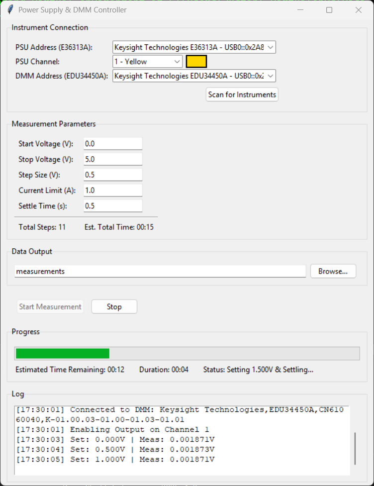

# PSU-DMM PyVISA Data Capture

This simple Python program is designed to automate voltage sweeps and data logging using Keysight bench equipment. It controls a Power Supply Unit (PSU) to step through a voltage range while recording voltage measurements from a Digital Multimeter (DMM). The program outputs the collected data to a CSV file.

## Supported Instruments

- **Power Supply:** Keysight E36313A 
  - *(Will probably work with similar models)*
- **Digital Multimeter:** Keysight EDU34450A
  - *(Will probably work with similar models)*

## Features

- **GUI Control:** Built with Tkinter for ease of use and configuration.
- **Automated Sweeps:** Configurable start voltage, stop voltage, step size, and settle time.
- **Data Logging:** Automatically saves measurements to a CSV file.
- **Instrument Discovery:** Scans and lists connected VISA instruments.

## Example Image:


## Quick Setup (Windows)

The included PowerShell script, `launch.ps1`, handles environment setup and dependency installation automatically.

1. Open a PowerShell terminal and navigate to the install directory.
2. Run the launch script:
   ```powershell
   .\launch.ps1
   ```
   - This will create a virtual environment, install the required dependencies, and launch the application.

## Manual Setup (Windows)

1. Install Python (3.x). Either from [Python.org](https://www.python.org/downloads/) or via the [Microsoft Store](https://apps.microsoft.com/search?query=Python).
2. Open a PowerShell terminal and navigate to the install directory.
3. Install dependencies:
   ```bash
   pip install -r requirements.txt
   ```
   *Note: You must have a [VISA backend](https://pyvisa.readthedocs.io/en/latest/introduction/getting.html#backend) installed (like NI-VISA or Keysight IO Libraries Suite) for PyVISA to communicate with instruments.*
4. Run the script:
   ```bash
   python visa_logger.py
   ```

## Sample CSV Output
| Timestamp                  | Set Voltage (V) | Measured Voltage (V) |
| -------------------------- | --------------- | -------------------- |
| 2026-01-27T14:53:14.875122 | 1               | 0.465121354          |
| 2026-01-27T14:53:16.174611 | 1.01            | 0.473769145          |
| 2026-01-27T14:53:17.474557 | 1.02            | 0.48230575           |
| 2026-01-27T14:53:18.774583 | 1.03            | 0.492258699          |
| 2026-01-27T14:53:20.074599 | 1.04            | 0.500748839          |
| 2026-01-27T14:53:21.373732 | 1.05            | 0.509241539          |
